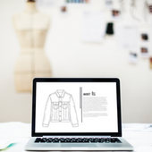
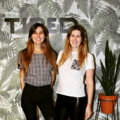
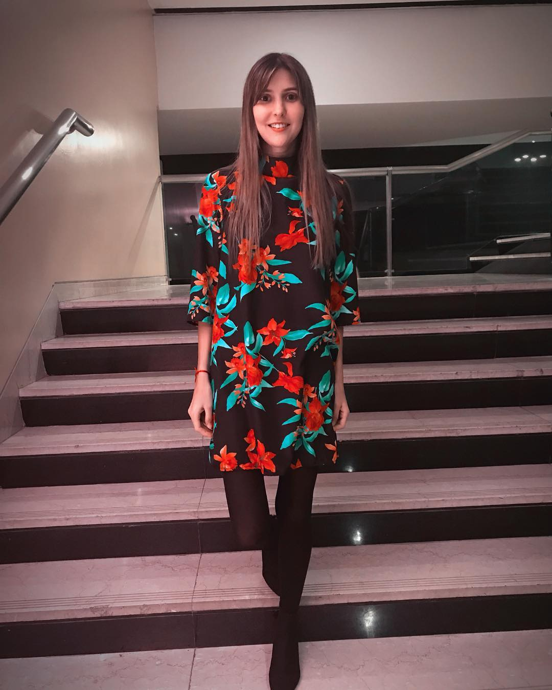
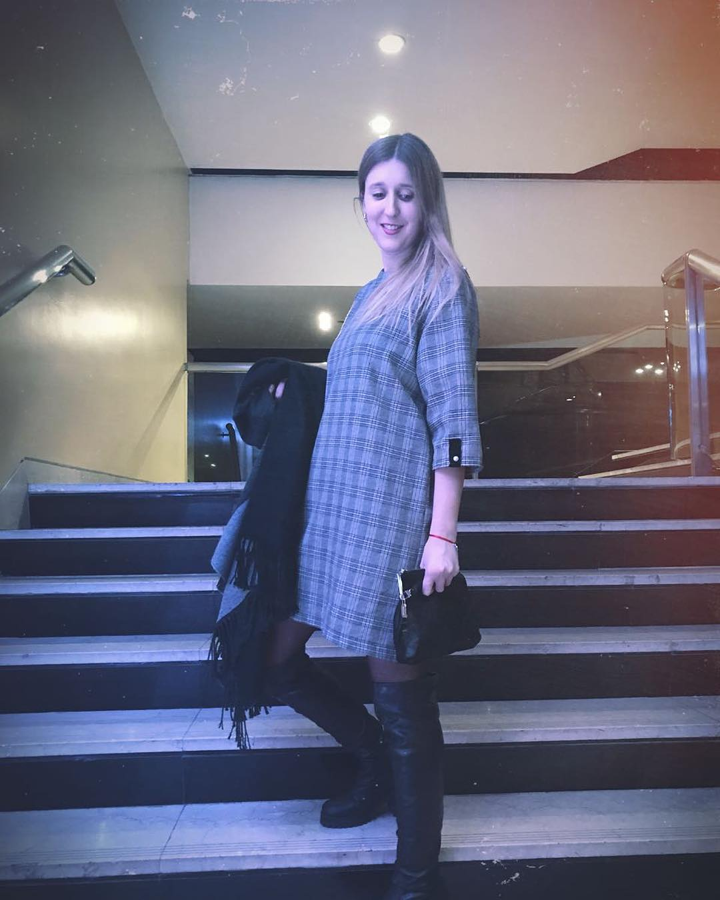

<!DOCTYPE html>
<html lang="en">

  <head>

    <meta charset="utf-8">
    <meta name="viewport" content="width=device-width, initial-scale=1, shrink-to-fit=no">
    <meta name="description" content="">
    <meta name="author" content="">

    <title>Alianzas emprendedoras</title>

    <!-- Bootstrap core CSS -->
    <link href="vendor/bootstrap/css/bootstrap.min.css" rel="stylesheet">

    <!-- Custom fonts for this template -->
    <link href="vendor/fontawesome-free/css/all.min.css" rel="stylesheet" type="text/css">
    <link href="https://fonts.googleapis.com/css?family=Montserrat:400,700" rel="stylesheet" type="text/css">
    <link href='https://fonts.googleapis.com/css?family=Kaushan+Script' rel='stylesheet' type='text/css'>
    <link href='https://fonts.googleapis.com/css?family=Droid+Serif:400,700,400italic,700italic' rel='stylesheet' type='text/css'>
    <link href='https://fonts.googleapis.com/css?family=Roboto+Slab:400,100,300,700' rel='stylesheet' type='text/css'>

    <!-- Custom styles for this template -->
    <link href="css/agency.min.css" rel="stylesheet">
    <link href="css/agency.css" rel="stylesheet">

  </head>

  <body id="page-top">

    <!-- Navigation -->
    <nav class="navbar navbar-expand-lg navbar-dark fixed-top" id="mainNav">
      

        
        <button class="navbar-toggler navbar-toggler-right" type="button" data-toggle="collapse" data-target="#navbarResponsive" saria-controls="navbarResponsive" aria-expanded="false" aria-label="Toggle navigation">
          Menu
          <i class="fas fa-bars"></i>
        </button>
        

          <ul class="navbar-nav text-uppercase ml-auto">
            <li class="nav-item">
              <a class="nav-link js-scroll-trigger" href="#services">Alianzas</a>
            </li>
            <li class="nav-item">
              <a class="nav-link js-scroll-trigger" href="#portfolio">Eventos</a>
            </li>
            <li class="nav-item">
              <a class="nav-link js-scroll-trigger" href="#about">Nuestra historia</a>
            </li>
            <li class="nav-item">
              <a class="nav-link js-scroll-trigger" href="#team">Quiénes somos</a>
            </li>
            <li class="nav-item">
              <a class="nav-link js-scroll-trigger" href="#contact">Contacto</a>
            </li>
          </ul>
        

      

    </nav>

    <!-- Header -->
    <header class="masthead">
      

        

          
Sumate a

          
ALIANZAS EMPRENDEDORAS

          <a class="btn btn-primary btn-xl text-uppercase js-scroll-trigger" href="#services">INSCRIBIRME</a>

        

      

    </header>

    <!-- Services -->
    <section id="services">
      

        

          

            <h2 class="section-heading text-uppercase">QUEREMOS ALIARNOS CON VOS</h2>
            <h3 class="section-subheading text-muted">Te invitamos el 12 de septiembre a las 19 horas a un espacio de networking para que puedas conectar con otros emprendedores. En este evento, de hora y media de duración, vas a llevarte contenido y nuevas alianzas para hacer exitoso tu negocio. El evento es gratuito pero podés colaborar con tu donación para ayudar a la ONG <strong>Festejo Solidario</strong>.</h3>
          

        

        

          

            
              <i class="fas fa-circle fa-stack-2x text-primary"></i>
              <i class="far fa-handshake fa-stack-1x fa-inverse"></i>
            
            <h4 class="service-heading">MISIÓN</h4>
            
Conectamos emprendedores en eventos que duran una hora y media en total, con el fin de que se lleven alianzas y nuevos conocimientos.

          

          

            
              <i class="fas fa-circle fa-stack-2x text-primary"></i>
              <i class="fas fa-chalkboard-teacher fa-stack-1x fa-inverse"></i>
            
            <h4 class="service-heading">VISIÓN</h4>
            
Hacemos énfasis en el networking. Pero además en cada evento hay charlas relámpago acerca de fundamentos claves para emprender y manejo de redes sociales

          

          

            
              <i class="fas fa-circle fa-stack-2x text-primary"></i>
              <i class="fas fa-hand-holding-heart fa-stack-1x fa-inverse"></i>
            
            <h4 class="service-heading">ACCIÓN</h4>
            
Los eventos son gratuitos y tienen un fin solidario. Si te interesa colaborar con la ONG Festejo Solidario podés sumarte con una donación.

          

        

      

    </section>

    <!-- Portfolio Grid -->
    <section class="bg-light" id="portfolio">
      

        

          

            <h2 class="section-heading text-uppercase">CHARLAS RELÁMPAGO</h2>
            <h3 class="section-subheading text-muted">Durante cada evento habrá workshops <i class="fas fa-bolt"></i> de 20 minutos sobre:</h3>
          

        

        

          

            <a class="portfolio-link" data-toggle="modal" href="#portfolioModal1">
              

                

                  <i class="fas fa-plus fa-3x"></i>
                

              

              
            </a>
            

              <h4>CLAVES PARA EMPRENDER</h4>
              
Por Tomás Mafia

            

          

          

            <a class="portfolio-link" data-toggle="modal" href="#portfolioModal2">
              

                

                  <i class="fas fa-plus fa-3x"></i>
                

              

              
            </a>
            

              <h4>INSTAGRAM PARA EMPRENDEDORES</h4>
              
Por María del Rosario Maldonado

            

          

          

            <a class="portfolio-link" data-toggle="modal" href="#portfolioModal3">
              

                

                  <i class="fas fa-plus fa-3x"></i>
                

              

              
            </a>
            

              <h4>NETWORKING</h4>
              
Presentación y Coffee break para conectar con otros emprendedores

            

          
    </section>

    <!-- About -->
    <section id="about">
      

        

          

            <h2 class="section-heading text-uppercase">NUESTRA HISTORIA</h2>
            <h3 class="section-subheading text-muted"></h3>
          

        

        

          

            <ul class="timeline">
              <li>
                

                  
                

                

                  

                    <h4></h4>
                    <h4 class="subheading">Así comenzamos:</h4>
                  

                  

                    
Siempre ayudábamos a nuestros amigos que empezaban algún emprendimiento, hasta que sentimos la necesidad de crear algo propio, fue en entonces que con el correr de los meses nació ROMEA, nuestra línea de indumentaria orientada a mujeres. 

                  

                

              </li>
              <li class="timeline-inverted">
                

                  
                

                

                  

                    <h4></h4>
                    <h4 class="subheading">Nuestra vida</h4>
                  

                  

                    
Somos Lucila y Luisina, hermanas, viviendo en CABA pero oriundas de Lincoln. 
                    Nos encanta pasar tiempo juntas. Amamos los domingos a la tarde de primavera ir a la plaza y descansar disfrutando el día, eso nos remonta a estar en casa. Nos apasiona emprender y organizar eventos con fines solidaros, por eso decidimos crear <strong>Alianzas emprendedoras</strong>.

                  

                

              </li>
              <li>
                

                  
                

                

                  

                    <h4></h4>
                    <h4 class="subheading">¡No todo es fácil!</h4>
                  

                  

                    
Los emprendedores somos muy solitarios, pasamos horas pensando en nuestros nuevos proyectos, en las ideas, en que podemos hacer para darle un valor agregado a nuestros productos o servicios. Por eso te ofrecemos un espacio de networking  para que juntos formemos alianzas emprendedoras. No estás solo en esto ¡Vas a conocer a colegas en tu misma situación! Además, lo más importante es que contribuimos a una causa solidaria. ¡Sumate aportando tu granito de arena!  

                  

                

              </li>
              <li class="timeline-inverted">
                

                  
                

                

                  

                    <h4></h4>
                    <h4 class="subheading">Preparate para triunfar</h4>
                  

                  

                    
Si sos emprendedor o emprendedora y trabajas desde tu casa, todas las mañanas cámbiate, peínate y arréglate para arrancar con actitud. Es el momento de abrir las puertas a un nuevo camino para que otros te acompañen. Si no sos capaz que abrirte a este cambio, seguramente tu emprendimiento fracase. Los emprendedores tenemos que ayudarnos entre todos para hacer #alianzasemprendedoras
                    Te invitamos a un espacio de networking para que puedas conectar con otros emprendedores. En este evento vas a llevarte contenido y nuevas alianzas para hacer exitoso tu negocio.

                  

                

              </li>
              <li class="timeline-inverted">
                

                  <h4>
                     alianzas
                     ♥</h4>
                

              </li>
            </ul>
          

        

      

    </section>

    <!-- Team -->
    <section class="bg-light" id="team">
      

        

          

            <h2 class="section-heading text-uppercase">QUIÉNES SOMOS</h2>
            <h3 class="section-subheading text-muted">¡Conocenos!</h3>
          

        

        

          

            

              
              <h4>Luisina Bueti Piorno</h4>
              
Contadora Pública, Lic. en Administración de Empresas (en curso), Emprendedora. La perseverancia, la motivación y el trabajo en equipo son la clave del éxito.

              <ul class="list-inline social-buttons">
                <li class="list-inline-item">
                  <a href="#">
                    <i class="fab fa-twitter"></i>
                  </a>
                </li>
                <li class="list-inline-item">
                  <a href="#">
                    <i class="fab fa-facebook-f"></i>
                  </a>
                </li>
                <li class="list-inline-item">
                  <a href="#">
                    <i class="fab fa-linkedin-in"></i>
                  </a>
                </li>
              </ul>
            

          

          

            

              
              <h4>Lucila Bueti Piorno</h4>
              
Contadora Pública, Lic. en Administración de Empresas (en curso), Emprendedora. Apasionada por mi trabajo. Busco nuevos desafíos para crear y aprender.

              <ul class="list-inline social-buttons">
                <li class="list-inline-item">
                  <a href="#">
                    <i class="fab fa-twitter"></i>
                  </a>
                </li>
                <li class="list-inline-item">
                  <a href="#">
                    <i class="fab fa-facebook-f"></i>
                  </a>
                </li>
                <li class="list-inline-item">
                  <a href="#">
                    <i class="fab fa-linkedin-in"></i>
                  </a>
                </li>
              </ul>
            

          

         
    </section>

    <!-- Clients -->
    <section class="py-5">
      

        

          

            
          

          

            
          

          

            
          

          

            
          

        

      

    </section>

    <!-- Contact -->
    <section id="contact">
      

        

          

            <h2  style="color:black" class="section-heading text-uppercase">INSCRIBITE PARA PARTICIPAR</h2>
            <h3 class="section-subheading text-muted">¡Sumate al evento del miércoles 12 de septiembre a las 19 horas</h3>
          

        

        

          

            <form id="contactForm" name="sentMessage" novalidate="novalidate">
              

                

                  

                    <input class="form-control" id="name" type="text" placeholder="Tu nombre *" required="required" data-validation-required-message="Please enter your name.">
                    

                  

                  

                    <input class="form-control" id="lastname" type="email" placeholder="Tu apellido *" required="required" data-validation-required-message="Please enter your email address.">
                    

                  

                  

                    <input class="form-control" id="email" type="tel" placeholder="Tu email *" required="required" data-validation-required-message="Please enter your phone number.">
                    

                  

                

                   

                  

                    <textarea class="form-control" id="message" placeholder="¿De qué se trata tu emprendimiento?*" required="required" data-validation-required-message="Please enter a message."></textarea>
                    

                  

                

                

                

                  

                  <button id="sendMessageButton" class="btn btn-primary btn-xl text-uppercase" type="submit">INSCRIBIRME</button>
                

              

            </form>
          

        

      

    </section>

    <!-- Footer -->
    <footer>
      

        

          

            Copyright &copy; María del Rosario Maldonado♥
          

          

            <ul class="list-inline social-buttons">
              <li class="list-inline-item">
                <a href="#">
                  <i class="fab fa-twitter"></i>
                </a>
              </li>
              <li class="list-inline-item">
                <a href="#">
                  <i class="fab fa-facebook-f"></i>
                </a>
              </li>
              <li class="list-inline-item">
                <a href="#">
                  <i class="fab fa-linkedin-in"></i>
                </a>
              </li>
            </ul>
          

          

            <ul class="list-inline quicklinks">
              <li class="list-inline-item">
                
              </li>
              <li class="list-inline-item">
                
              </li>
            </ul>
          

        

      

    </footer>

    <!-- Portfolio Modals -->

    <!-- Modal 1 -->
    

      

        

          

            

              

            

          

          

            

              

                

                  <!-- Project Details Go Here -->
                  <h2 class="text-uppercase">Project Name</h2>
                  
Lorem ipsum dolor sit amet consectetur.

                  
                  
Use this area to describe your project. Lorem ipsum dolor sit amet, consectetur adipisicing elit. Est blanditiis dolorem culpa incidunt minus dignissimos deserunt repellat aperiam quasi sunt officia expedita beatae cupiditate, maiores repudiandae, nostrum, reiciendis facere nemo!

                  <ul class="list-inline">
                    <li>Date: January 2017</li>
                    <li>Client: Threads</li>
                    <li>Category: Illustration</li>
                  </ul>
                  <button class="btn btn-primary" data-dismiss="modal" type="button">
                    <i class="fas fa-times"></i>
                    Close Project</button>
                

              

            

          

        

      

    

    <!-- Modal 2 -->
    

      

        

          

            

              

            

          

          

            

              

                

                  <!-- Project Details Go Here -->
                  <h2 class="text-uppercase">Project Name</h2>
                  
Lorem ipsum dolor sit amet consectetur.

                  
                  
Use this area to describe your project. Lorem ipsum dolor sit amet, consectetur adipisicing elit. Est blanditiis dolorem culpa incidunt minus dignissimos deserunt repellat aperiam quasi sunt officia expedita beatae cupiditate, maiores repudiandae, nostrum, reiciendis facere nemo!

                  <ul class="list-inline">
                    <li>Date: January 2017</li>
                    <li>Client: Explore</li>
                    <li>Category: Graphic Design</li>
                  </ul>
                  <button class="btn btn-primary" data-dismiss="modal" type="button">
                    <i class="fas fa-times"></i>
                    Close Project</button>
                

              

            

          

        

      

    

    <!-- Modal 3 -->
    

      

        

          

            

              

            

          

          

            

              

                

                  <!-- Project Details Go Here -->
                  <h2 class="text-uppercase">Project Name</h2>
                  
Lorem ipsum dolor sit amet consectetur.

                  
                  
Use this area to describe your project. Lorem ipsum dolor sit amet, consectetur adipisicing elit. Est blanditiis dolorem culpa incidunt minus dignissimos deserunt repellat aperiam quasi sunt officia expedita beatae cupiditate, maiores repudiandae, nostrum, reiciendis facere nemo!

                  <ul class="list-inline">
                    <li>Date: January 2017</li>
                    <li>Client: Finish</li>
                    <li>Category: Identity</li>
                  </ul>
                  <button class="btn btn-primary" data-dismiss="modal" type="button">
                    <i class="fas fa-times"></i>
                    Close Project</button>
                

              

            

          

        

      

    

    <!-- Modal 4 -->
    

      

        

          

            

              

            

          

          

            

              

                

                  <!-- Project Details Go Here -->
                  <h2 class="text-uppercase">Project Name</h2>
                  
Lorem ipsum dolor sit amet consectetur.

                  
                  
Use this area to describe your project. Lorem ipsum dolor sit amet, consectetur adipisicing elit. Est blanditiis dolorem culpa incidunt minus dignissimos deserunt repellat aperiam quasi sunt officia expedita beatae cupiditate, maiores repudiandae, nostrum, reiciendis facere nemo!

                  <ul class="list-inline">
                    <li>Date: January 2017</li>
                    <li>Client: Lines</li>
                    <li>Category: Branding</li>
                  </ul>
                  <button class="btn btn-primary" data-dismiss="modal" type="button">
                    <i class="fas fa-times"></i>
                    Close Project</button>
                

              

            

          

        

      

    

    <!-- Modal 5 -->
    

      

        

          

            

              

            

          

          

            

              

                

                  <!-- Project Details Go Here -->
                  <h2 class="text-uppercase">Project Name</h2>
                  
Lorem ipsum dolor sit amet consectetur.

                  
                  
Use this area to describe your project. Lorem ipsum dolor sit amet, consectetur adipisicing elit. Est blanditiis dolorem culpa incidunt minus dignissimos deserunt repellat aperiam quasi sunt officia expedita beatae cupiditate, maiores repudiandae, nostrum, reiciendis facere nemo!

                  <ul class="list-inline">
                    <li>Date: January 2017</li>
                    <li>Client: Southwest</li>
                    <li>Category: Website Design</li>
                  </ul>
                  <button class="btn btn-primary" data-dismiss="modal" type="button">
                    <i class="fas fa-times"></i>
                    Close Project</button>
                

              

            

          

        

      

    

    <!-- Modal 6 -->
    

      

        

          

            

              

            

          

          

            

              

                

                  <!-- Project Details Go Here -->
                  <h2 class="text-uppercase">Project Name</h2>
                  
Lorem ipsum dolor sit amet consectetur.

                  
                  
Use this area to describe your project. Lorem ipsum dolor sit amet, consectetur adipisicing elit. Est blanditiis dolorem culpa incidunt minus dignissimos deserunt repellat aperiam quasi sunt officia expedita beatae cupiditate, maiores repudiandae, nostrum, reiciendis facere nemo!

                  <ul class="list-inline">
                    <li>Date: January 2017</li>
                    <li>Client: Window</li>
                    <li>Category: Photography</li>
                  </ul>
                  <button class="btn btn-primary" data-dismiss="modal" type="button">
                    <i class="fas fa-times"></i>
                    Close Project</button>
                

              

            

          

        

      

    

    <!-- Bootstrap core JavaScript -->
    
    

    <!-- Plugin JavaScript -->
    

    <!-- Contact form JavaScript -->
    
    

    <!-- Custom scripts for this template -->
    

  </body>

</html>
